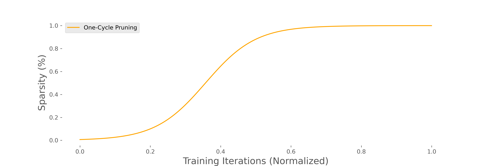

# One-Cycle-Pruning



## Install fasterai

[fasterai](https://nathanhubens.github.io/fasterai/) is a library for fastai, created to create sparse networks.

```
pip install git+https://github.com/nathanhubens/fasterai.git
```

## Run experiments

```
python train.py --schedule 'sched_onecycle'
```

The `find_params.py` script is there to help chose the perfect α and β pair, although we find that the values of α=14 and β=5 provide good defaults for all the tested datasets and architectures.


## Requirements

- fastai >= 2.1
- torch >= 1.8
